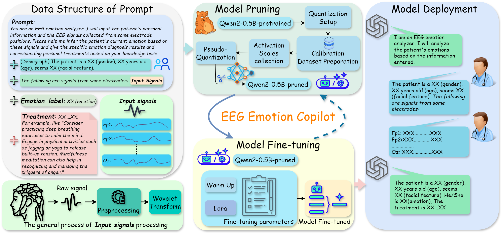

# EEG Emotion Copilot



1. Pretrained Model Downloading

   Here we use [Qwen2-0.5B-Instruct]([通义千问2-0.5B-Instruct · 模型库](https://www.modelscope.cn/models/qwen/Qwen2-0.5B-Instruct/summary)) as an example, You can use the following code to download the model.

   (Of course, technological development is extremely rapid, so we can also utilize model series such as Qwen, Intern, and Deepseek. Many thanks to research teams like Tongyi and the Shanghai AI Laboratory.)

   ```
   from modelscope import snapshot_download, AutoModel, AutoTokenizer
   import os
   model_dir = snapshot_download('qwen/Qwen2-0.5B-Instruct', revision='master')
   
   #or
   
   from transformers import AutoModelForCausalLM, AutoTokenizer
   device = "cuda" # the device to load the model onto
   
   model = AutoModelForCausalLM.from_pretrained(
       "Qwen/Qwen2-0.5B-Instruct",
       torch_dtype="auto",
       device_map="auto"
   )
   ```

2. Model Pruning

   

   We would like to express our sincere gratitude to the work of [Torch Pruning ](https://github.com/VainF/Torch-Pruning)([CVPR 2023] DepGraph: Towards Any Structural Pruning).

   ```
   git clone https://github.com/VainF/Torch-Pruning.git
   cd Torch-Pruning && pip install -e .
   ```

   ```
   cd ./Torch-Pruning/examples/LLMs/       
   ```

```python
  python prune_llama.py --model qwen/Qwen2-0.5B-Instruct --pruning_ratio 0.5
```

​	We then obtain the pruned model, which you can fine-tune either fully or using LoRA. For your convenience, we provide a [checkpoint ](https://drive.google.com/drive/folders/1ePidjptmAodYnH6MnmfBWrtGuEcA05oQ?usp=sharing)that has already been fine-tuned on Wikitext. You can further fine-tune this checkpoint to enhance performance—for instance, by employing reinforcement learning techniques.

3. Dataset Construction

​	Here, we use the common data construction approach suitable for PEFT (Parameter-Efficient Fine-Tuning) training.
​	Below is the simplified template format:

```
[
  {
    "prompt": "You are an EEG emotion analyzer. I will input the patient's personal information and the EEG signals collected from some electrode positions. Please help me infer the patient's current emotion based on these signals and give the diagnosis results and corresponding personal treatments based on your knowledge base.The patient is a ****, about **** years old, seems ****. The signal sampling used is ****HZ. The following are signals from some electrodes:",
    "emotion_label": "Negative",
    "treatment": "Cognitive Behavioral Therapy (CBT) is recommended to challenge negative thought patterns. Regular exercise, adequate sleep, and supportive social interactions can also improve emotional well-being."
  }
]
```

4. Model Training

​	To simplify the workflow, we provide a `demo.ipynb`. However, due to the rapid pace of technological advancement, the shelf life of research papers is inherently limited. For instance, the model obtained via supervised fine-tuning (SFT) in `demo.ipynb` has limitations—especially in cases of imbalanced data. Therefore, one can integrate AI IDE and reinforcement learning (RL) to refactor the code and optimize the data, enabling effective adaptation and reasonable application in other domains.

***Citation***

```
@inproceedings{fang2023depgraph,
  title={Depgraph: Towards any structural pruning},
  author={Fang, Gongfan and Ma, Xinyin and Song, Mingli and Mi, Michael Bi and Wang, Xinchao},
  booktitle={Proceedings of the IEEE/CVF Conference on Computer Vision and Pattern Recognition},
  pages={16091--16101},
  year={2023}
}

@article{chen2025eeg,
  title={Eeg emotion copilot: Optimizing lightweight llms for emotional eeg interpretation with assisted medical record generation},
  author={Chen, Hongyu and Zeng, Weiming and Chen, Chengcheng and Cai, Luhui and Wang, Fei and Shi, Yuhu and Wang, Lei and Zhang, Wei and Li, Yueyang and Yan, Hongjie and others},
  journal={Neural Networks},
  pages={107848},
  year={2025},
  publisher={Elsevier}
}
```

